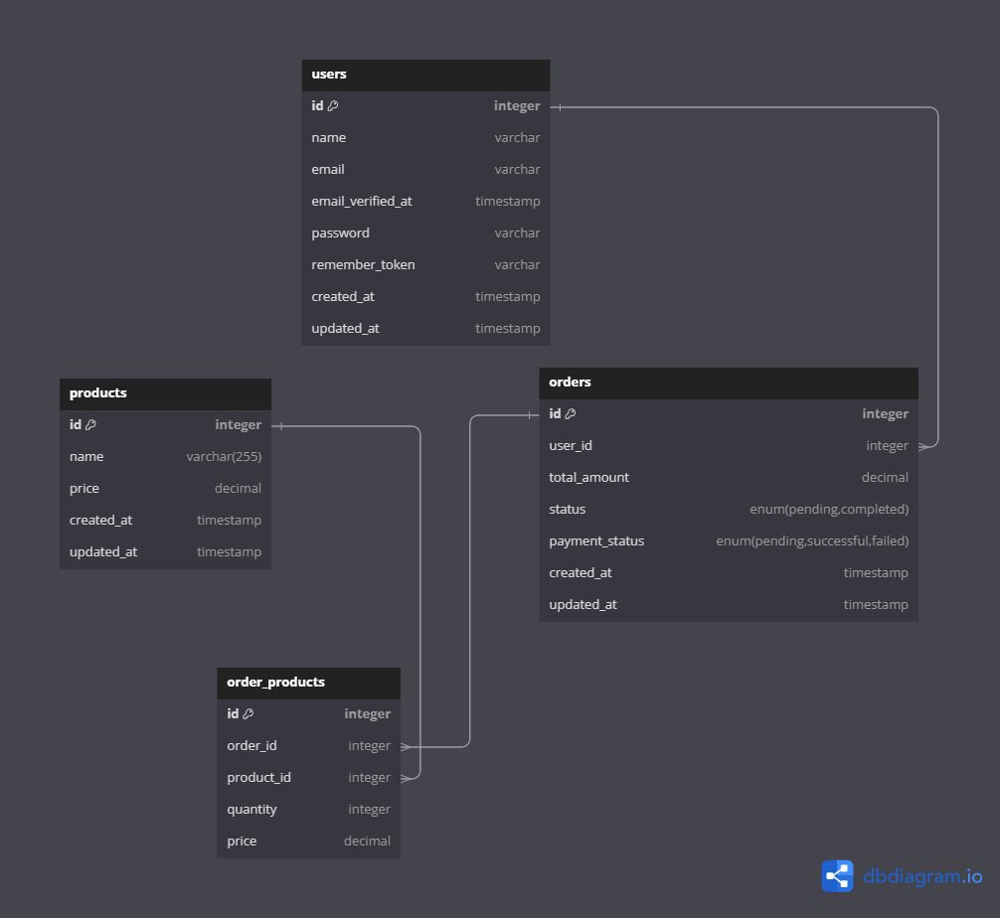

# Paysky Laravel Task - Basic E-Commerce Payment System API

## Objective
The goal of this task is to build a simple API that handles orders and payments for an e-commerce platform. The API will allow the creation of orders, retrieval of order details, and updating the payment status of orders.

## Features
- **Order Management**:
    - Create an order by accepting product IDs, quantities, and prices.
    - Calculate total amount including a 10% tax.
    - Store order details and related products.
- **Payment Integration**:
    - Simulate payment status updates (pending, successful, failed).
    - Provide an endpoint to update the payment status.
- **Authentication** (Bonus):
    - Implement authentication using Laravel Passport or Sanctum.
- **Soft Delete for Orders** (Bonus):
    - Implement a soft delete feature for orders.
- **Unit and Feature Tests** (Bonus):
    - Provide unit and feature tests for the order and payment functionalities.

## Tech Stack
- **Backend**: Laravel 11
- **Database**: MySQL
- **Authentication**: Sanctum
- **Containerization**: Docker (optional)

## Setup Instructions

### Requirements
<p align="center"> <a href="https://www.php.net/">  </a> <a href="https://www.mysql.com/">  </a> <a href="https://getcomposer.org/">
 </a> 
<a href="https://laravel.com/">  </a> 
</p>

-   **PHP**: 8.2 or higher
-   **MySQL**: 8.0 or higher
-   **Composer**: 2.0 or higher

### Installation

1. **Clone the repository**:
   ```bash
   git clone https://github.com/anssrabie/paysky-task.git

2. **Install dependencies: Navigate into the project folder and run**:
   ```bash
   cd paysky-task
   composer install
   
3. **Environment setup: Copy the .env.example file to .env**:
   ```bash
   cp .env.example .env

4. **Generate the application key**:
   ```bash
   php artisan key:generate

5. **Set up the database**:
   - Update your .env file with your database credentials.
   - Run the migrations and seeders:
   ```bash
    php artisan migrate:fresh --seed
   
6. **Run the application**:
   ```bash
    php artisan serve
--------------------

## Postman API Documentation

You can access the Postman API documentation for this project using the following link:

[Postman API Documentation](https://documenter.getpostman.com/view/40986067/2sAYQZGrnc)


-------------------
## Entity Relationship Diagram (ERD)

### Users and Orders:
- There is a **one-to-many** relationship between **Users** and **Orders**, where a user can have multiple orders, but each order belongs to one user. This relationship is represented by the `user_id` in the **Orders** table.

### Orders and Order_Products:
- There is a **one-to-many** relationship between **Orders** and the **Order_Products** table. Each order can have multiple products, and this relationship is managed by the **Order_Products** pivot table.

### Products and Order_Products:
- There is a **many-to-many** relationship between **Products** and **Orders**, managed by the **Order_Products** pivot table. An order can have multiple products, and a product can be part of many orders. The **Order_Products** table contains the `quantity` and `price` of each product in the order.

### Users and Products:
- While there isn't a direct relationship between **Users** and **Products**, users indirectly interact with products by placing orders that contain these products.


